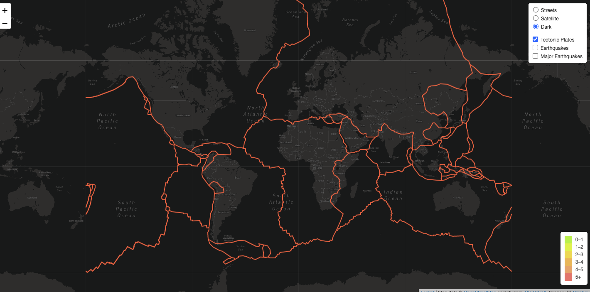
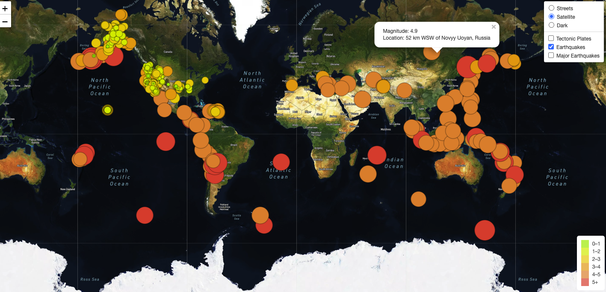
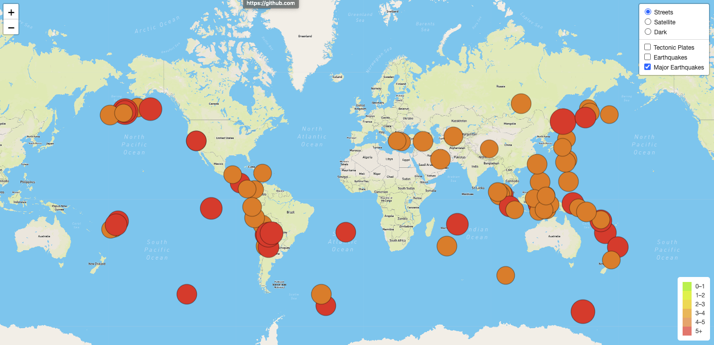
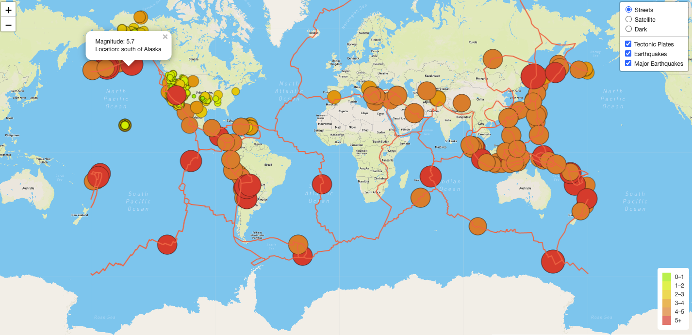

# Mapping_Earthquakes
## Overview
The purpose of this analysis is to show case the earthquake data in relation to the tectonic plates’ location on the earth, all the earthquakes with a magnitude greater than 4.5 on the map, and the major earthquakes for the past 7 days. The analysis also make it easier for the users to toggle layer control to choose the information they would like to see. The analysis also add pop up that displays the location and magnitude of the earthquake to each circle that indicate the earthquakes

## Results
### Tectonic Plates
The data shows that, tectonic plates lies in North American, Pacific, Eurasian, African, Indo-Australian, Australian, Indian, South American and Antarctic.
Tectonic plate is a section in which earth is cracked. From the analysis, it is shows that there are nine major tectonic plates in the world.
.
### Earthquakes
The data also that earthquakes with a magnitude of 4.5 and above occur in the middle and coastal line of  of the Pacific, Atlantic and Indian Ocean as its shows in the chart below.

### Major Earthquakes
The major earthquakes that occurred in that past 7 days clustered along coastal line of South American countries, Alaska, Australia and Asia.

### All
All the data(tectonic, Earthquakes and Major Earthquakes) can be viewed together as below. It can be duduced from the chart that, All earthquakes both major and minor lie along the tectonic plates.

